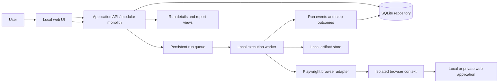
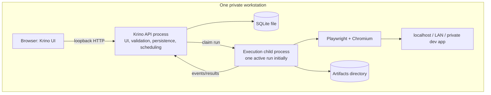

# Krino: Web Test Automation Platform Architecture

**Status:** Proposed for review; no application implementation started  
**Date:** 2026-09-24  
**Purpose:** Architecture and delivery plan for a private, local-first web test automation tool.

## 1. Project definition

Krino is a private application for defining, running, and reviewing browser-based tests against the user's own web applications. Its first useful form should run on one developer workstation, keep test definitions and results locally, and reach applications that the workstation can already reach: `localhost`, private LAN addresses, and private development DNS names.

Krino is inspired by general architectural ideas documented by modern test platforms: separate test management from execution, let execution happen close to a private application, report step-level outcomes and artifacts, and make action vocabularies extensible. These are common engineering patterns, not a request to reproduce Testsigma's implementation or product behavior.

## 2. Scope and non-goals

### V1 scope

- Web UI automation in a supported desktop browser, initially Chromium.
- A small, versioned test-definition format with navigation, common user actions, and assertions.
- Test authoring and execution from a local web UI.
- Local/private application targets, test runs, step outcomes, and basic reports.
- Screenshots and browser traces as run artifacts, especially on failure.
- A single local execution worker, with a seam that can later be implemented by a separate agent.
- A small, typed action registry so the core runner does not become a collection of UI-specific conditionals.

### Explicit non-goals for V1

Mobile and API testing; cloud or public SaaS hosting; multi-tenancy; enterprise identity and permissions; distributed queues and workers; Kubernetes; tunnels to remote execution; advanced secrets management; complex CI orchestration; AI, natural-language generation, self-healing, or autonomous agents; an open public addon marketplace; arbitrary user-authored code execution.

## 3. Evidence, recommendations, and assumptions

This document labels rationale in three ways:

- **Documented fact** summarizes a behavior or concept in a linked public reference.
- **Recommendation** is the architecture proposed for Krino, based on the project's goals and trade-offs.
- **Assumption** is an initial constraint to make the plan concrete; it can be changed during review.

Testsigma's public Agent FAQ describes a Java utility installed on the machine running tests. It pulls work from the server, rather than accepting server-initiated connections, and provides a way for a hosted control plane to run tests on devices inside a private network. Its on-prem architecture also documents a larger server, database, and role-separated services. Those patterns solve deployment and network-boundary problems at a scale Krino does not initially have.

Testsigma documents addons as a way to extend built-in actions, including private actions; its Modern addon material describes typed TypeScript packages and distinguishes action, condition, test-data, and hook capabilities. The useful lesson is a stable extension contract and explicit capabilities, not the need for a marketplace, upload service, or separate addon server.

Testsigma describes auto-healing as locator repair during execution. Krino should preserve locator metadata and execution evidence now, but must not silently change a test's meaning or pass a test because a heuristic found a similar element.

## 4. Proposed architecture

### Logical architecture



### Deployment for V1



The diagrams show logical boundaries, not separate services. V1 is one installable local application, with the test execution isolated in a child process. The API and UI may initially be packaged and launched together. Execution is behind an interface (`ExecutionWorker`/runner contract) so it can later move to another process or host without making the V1 architecture depend on remote infrastructure.

### Major components and responsibilities

| Component | Responsibility | V1 boundary |
|---|---|---|
| Web UI | Manage targets and tests; start runs; inspect step results and artifacts | Local browser UI; no direct database or browser access |
| Application API | Validate requests and definitions, manage tests/runs, schedule work, serve reports/artifacts | One local backend process |
| Test repository | Persist test definitions, target profiles, run snapshots and outcomes | SQLite with migrations |
| Definition validator | Validate schema version, action types, arguments and locator structure | Shared TypeScript types plus runtime validation |
| Run coordinator | Create immutable run snapshots, enforce state transitions, select eligible worker and persist events | In-process coordinator backed by SQLite queue rows |
| Execution worker | Claim a run, create isolated browser context, execute steps, collect artifacts and report outcome | Local child process; concurrency 1 by default |
| Browser adapter | Translate typed actions and assertions into Playwright calls | Playwright implementation only in V1 |
| Artifact store | Store screenshots, trace archives and logs with stable run/step associations | Files under app data directory; DB stores metadata and relative paths |
| Report views | Summarize pass/fail/queued/running and show step timeline, errors, duration, artifacts | Basic run report; no analytics service |
| Action registry | Map validated action IDs to typed handlers and metadata | Built-in actions only; private extension contract later |

## 5. Test representation and storage model

### Recommendation: versioned JSON definitions plus relational run records

Use a versioned, schema-validated JSON document as the canonical test definition. Store it in SQLite as JSON text associated with a stable test-case row. This keeps the format portable, easy to diff/export, and natural for TypeScript while retaining relational indexes and foreign keys for listing, status, run history, and filtering.

Do not make YAML the canonical format in V1. YAML's authoring friendliness does not offset another parser and more implicit type/format behavior when the first authoring surface is a UI. A YAML export/import can be considered after the JSON schema stabilizes. A custom text DSL would create a grammar, editor, and migration burden before there is evidence that the UI or JSON format is limiting.

Do not make each step a separate database entity at first. The test definition is naturally an ordered aggregate. A later migration may extract step rows if searching, reuse, concurrent editing, or very large tests justify it.

### Conceptual test shape

```json
{
  "schemaVersion": 1,
  "id": "stable-test-id",
  "name": "User can sign in",
  "description": "Checks the primary sign-in flow",
  "targetId": "local-app",
  "steps": [
    { "id": "step-1", "action": "navigate", "url": "/login" },
    {
      "id": "step-2",
      "action": "fill",
      "target": { "strategy": "label", "value": "Email" },
      "value": { "kind": "literal", "value": "qa@example.test" }
    },
    {
      "id": "step-3",
      "action": "click",
      "target": { "strategy": "role", "role": "button", "name": "Sign in" }
    },
    {
      "id": "step-4",
      "action": "assertVisible",
      "target": { "strategy": "role", "role": "heading", "name": "Dashboard" }
    }
  ]
}
```

This is an illustrative shape, not a frozen contract. The schema should use discriminated action variants and explicit parameter types. A step should have a stable ID, action ID, optional target locator, action-specific arguments, and an optional human-readable note. Avoid an untyped `parameters: any` blob. Runtime values and secrets should be modeled separately from literal text so credentials can be redacted and eventually sourced from environment variables or an OS secret store.

### Initial records

- **TargetProfile:** ID, name, base URL, allowed origins, browser choice, viewport, timeout defaults, optional environment variable references. Never store raw secrets in a test definition.
- **TestCase:** ID, name, description, tags, definition JSON, schema version, created/updated timestamps, archived flag.
- **TestRun:** ID, test-case ID, requested timestamp/source, status, definition snapshot, target snapshot (secrets omitted), browser/runtime version, start/end timestamps, summary, error category.
- **StepResult:** run ID, step ID/order, action, status, start/end, resolved locator summary, concise error and diagnostic metadata.
- **Artifact:** run ID, optional step ID, type, relative path, MIME type, size, creation time, retention status.
- **RunEvent (optional compact log):** ordered lifecycle events for the UI and post-run debugging; do not duplicate all application logs into the database.

Run snapshots make old reports interpretable after a test has changed. State transitions should be explicit: `queued → running → passed | failed | cancelled | error`. `error` means the harness could not complete or classify execution, while `failed` means a test action/assertion failed. Cancellation and worker-crash recovery need defined behavior before a queue is exposed in the UI.

## 6. Execution lifecycle and data flow

Recommended lifecycle:

1. The user creates or edits a test; the API validates the versioned definition and persists it.
2. The user requests a run. The API validates the target profile and creates a run record containing immutable definition and target snapshots.
3. The run coordinator enqueues the run transactionally in SQLite and returns the run ID immediately.
4. A local worker claims one queued run using an atomic state change. It records a lease/heartbeat so an interrupted process can be recognized.
5. The worker resolves configuration and launches/reuses a Playwright browser process. Each test case receives a fresh browser context to isolate cookies, local storage, permissions, and session state.
6. The worker executes steps in order through typed action handlers. Playwright locators and assertions wait for expected actionability/state within bounded timeouts; arbitrary fixed sleeps are not a normal step type.
7. Before/after each step, the worker records timestamps and outcome. On failure, it captures a screenshot and Playwright trace; console/page errors may be attached as diagnostics. Secrets and sensitive form values are redacted from logs.
8. The worker writes artifacts to the local artifact store and streams/returns structured step events and the terminal result.
9. The coordinator persists results and marks the run terminal. A worker exit without a terminal result becomes `error` after lease timeout/reconciliation.
10. The report UI renders the immutable test snapshot, status timeline, failed step/error, durations, browser info, and artifact links.

The queue is valuable even for local asynchronous execution because browsers can take minutes, the UI must stay responsive, and run state needs crash recovery. This is not a recommendation for Redis, RabbitMQ, or a distributed queue. A small SQLite-backed queue with one worker is sufficient.

## 7. Browser automation technology

### Recommendation: Playwright with TypeScript

Use Playwright as the browser control and diagnostics layer, but initially build Krino's own small data-driven step executor on top of Playwright's library API. Keep the Krino definition format independent of Playwright's exported types. Use the Playwright Test package only if conventional source-authored tests or its reporter/fixture model becomes a direct fit; do not generate ad-hoc TypeScript test source from UI definitions as the primary execution mechanism.

**Documented facts:** Playwright documents Chromium, Firefox, and WebKit projects, configurable headless/headed execution, locator APIs, browser contexts, retry support, and HTML/JSON/JUnit reporters. Its guidance recommends user-facing locators and explicit contracts; locators include waiting and retry behavior. Selenium is centered on the cross-browser WebDriver interface. Puppeteer is a JavaScript library controlling Chrome or Firefox through DevTools Protocol or WebDriver BiDi.

**Recommendation rationale:** Playwright fits TypeScript and local browser execution particularly well; its locator, actionability, context isolation, trace, screenshot, and multi-browser capabilities give a strong debugging base. Starting with Chromium keeps installs and behavior predictable. Its locator objects support semantic strategies without forcing Krino to expose Playwright directly. A small custom executor is a good match for user-authored JSON steps and gives Krino precise control over step-level reports and plugin dispatch.

**Alternatives:** Selenium is a sound choice when a broad WebDriver ecosystem, remote Grid, language choice, or browser/vendor interoperability is an immediate requirement. None is in the initial scope, so WebDriver's broader abstraction and external driver setup are not advantages large enough to outweigh Playwright's integrated workflow. Puppeteer is capable and remains a reasonable Chrome-centric library, but its narrower browser ecosystem makes it less attractive when cross-browser expansion is a likely next step. These are trade-offs, not capability deficiencies.

### Runner behavior

- One Chromium browser process can serve serial test cases, each in a new context; keep default concurrency at one until test isolation and machine load are understood.
- Use explicit global, navigation, and action timeouts; expose sane profile defaults.
- Fail fast on the first failed step in a case for V1. Record subsequent steps as skipped.
- Do not enable silent retries by default. Retries can hide flakiness; if added, report attempts separately and distinguish flaky from passed-on-first-attempt.
- Capture trace on failure by default and allow a headed run for local debugging. Retention/size limits must be configurable.
- Avoid arbitrary JavaScript evaluation in the initial action set.

## 8. Agent and worker architecture

### V1: no separately installed network agent

**Recommendation:** Do not build an agent daemon as a V1 requirement. The UI, API, queue, and execution worker run on the same workstation. The browser therefore shares that workstation's network reachability and can open `http://localhost:3000`, `http://192.168.x.x`, and private development domains without publishing them or creating a tunnel.

Run browser execution in a child process instead of inside an HTTP request handler. This prevents long tests and browser crashes from tying up API request handling, and provides a simple boundary for timeouts and worker restart. This local worker is not yet a separate agent service: it does not register to a remote control plane, accept network commands, or require a second deployment.

### Later: agent interface and reasons to introduce it

Introduce an independently installable local agent only when one of these becomes real: the control plane runs on another machine; the browser must run on a different OS/device; separate machines need different private network access; or runner lifecycle and upgrades need independence from the UI/API.

Future agent responsibilities: advertise capabilities and health; pull/lease eligible jobs over an outbound authenticated connection; run the browser in the agent's network; upload structured events and artifacts; heartbeat and report process/browser versions. The control plane should not open inbound firewall ports to the private runner. For a private single-user deployment, an outbound pull connection with short-lived agent credentials is a reasonable eventual model. Do not implement a remote tunnel merely to reach the user's local app when the local worker already has direct access.

An `ExecutionWorker` boundary should accept a run snapshot and emit typed events/result. Its V1 implementation is local IPC or a child process protocol. A future remote implementation can use HTTPS polling plus long-polling or WebSocket events; the precise protocol is an open decision until a second machine is needed.

## 9. Local/private networking and safety model

- Run the application bound to loopback (`127.0.0.1`) by default. Access to Krino itself should not be exposed on the LAN unless the user deliberately configures it.
- Browser execution runs in the user's local process and uses normal host routing and DNS. A target need not be reachable from an external service; no public URL or inbound firewall opening is required.
- Target profiles define base URL and allowed origins. Relative `navigate` URLs resolve against the configured base URL. This keeps test data portable between local apps and a future staging profile.
- Restrict navigation and requests to configured origins by default, with an explicit opt-in for additional origins needed by a test. This reduces accidental drift to unrelated sites and makes the boundary visible. Document that a browser request filter is not a complete sandbox and that tests run with the user's operating-system permissions.
- Do not fetch target pages from the API server. The browser worker should be the one making application requests; this avoids turning the backend into an arbitrary URL-fetch service.
- Do not bundle broad proxy/tunnel capability in V1. For a future remote controller, prefer an agent inside the target network. If remote browser-to-private-app access ever requires tunneling, treat it as a separate security design with explicit endpoint authorization, authentication, audit, and shutdown behavior.
- Support local development certificates through a visible opt-in profile setting rather than globally ignoring TLS errors.
- Store artifacts locally with restrictive filesystem permissions where practical; support deletion/retention settings before long-term history grows.

## 10. Locator and element architecture

Represent a target as a semantic, serializable locator descriptor interpreted by the Playwright adapter, not as a CSS string everywhere. For example:

```json
{ "strategy": "role", "role": "button", "name": "Save", "exact": true }
```

Recommended initial strategies: accessible role + accessible name, label, placeholder, visible text, test ID, and explicit CSS. XPath can be supported as a lower-level escape hatch if a real test needs it, but should not be the default in the UI or generated format. Accessibility roles and labels tend to assert user-visible semantics; test IDs are useful stable contracts when visible semantics are insufficient. CSS/XPath are necessary for unusual or poorly labeled DOMs but couple tests more tightly to page structure.

Keep locators structured: strategy, selector fields, exactness, optional scope/within descriptor, and optional description. Avoid storing a serialized Playwright selector string as the only identity. Use Playwright's strict matching behavior; if a locator is ambiguous, fail with a clear error rather than silently choosing `.first()`.

For future fallback/healing, preserve a primary locator and zero or more ordered candidates with provenance (`authored`, `recorded`, or `suggested`). V1 evaluates only the primary descriptor and never mutates it. At future run time, a resolver can emit an evidence record containing which candidate matched, match count, accessible name, role, and screenshot/trace reference. A proposed replacement should be reviewable and persisted only after explicit approval. A heuristic that selects a candidate must not silently turn an assertion failure into a pass.

## 11. Custom actions and addon architecture

V1 should ship a closed built-in registry of typed action handlers. The core runner owns lifecycle, timeout, reporting, browser/session, and error conversion. An action handler owns one operation and declares a stable ID, input schema, display metadata, and execution function. The test schema references IDs, never UI labels.

Later, a private action package can implement `CREATE_CUSTOMER`, `RESET_TEST_DATA`, `GENERATE_TEST_ACCOUNT`, or `VERIFY_BUSINESS_RULE`. Prefer a typed TypeScript SDK and a locally configured allowlist of trusted packages. An action receives a narrow execution context (logger, typed input, target profile, optional browser page/context capability) and returns a typed result; it must not mutate global runner state. Distinguish page actions, data generators, conditions, and run hooks because they need different capabilities and safety boundaries.

Do not add a plugin marketplace, remote addon server, hot reload, runtime package installation from the UI, or arbitrary uploaded JavaScript. Loading addon code is executing trusted code with the user's local privileges; package provenance, version pinning, capabilities, and sandbox limits need deliberate design. A worker process can eventually improve crash containment, but is not a security sandbox by itself.

## 12. Future AI, Jev, and self-healing boundaries

AI should be an optional authoring/analysis subsystem above the deterministic runner, not a dependency of core test execution. A future flow can take a natural-language request and application context, produce a draft `TestDefinition`, validate it with the same schema, and require human review before saving. Failure analysis can consume read-only run events, errors, traces, screenshots, and test snapshots and return explanations or suggested edits. Normal runs must remain runnable offline without an LLM credential.

Jev from TypeSafe AI should sit behind a narrow decision-provider interface when its role is concrete: bounded decisions such as ranking locator candidates or classifying a failure from a constrained evidence packet. Define typed inputs/outputs, evidence references, timeouts, and a deterministic fallback. Jev must not directly execute arbitrary browser actions or change a test definition during a run. Confirm the exact Jev library/product and integration contract before selecting a package or dependency; this plan does not assume a specific API.

Future self-healing can be split into proposal and approval: (1) capture failed locator evidence, (2) propose candidate selectors with confidence and evidence, (3) optionally run a verification check in a controlled replay, (4) show old/new locator and impact, (5) apply only after user approval, and (6) keep history/revert. This design preserves deterministic test meaning and makes AI-assisted changes auditable. Silent mutation or pass-on-similarity is explicitly out of scope.

## 13. Recommended technology stack

| Area | Recommendation | Reason / trade-off |
|---|---|---|
| Language | TypeScript end to end | Shared types and schemas; strong Playwright ecosystem; familiar to coding agents and easy to debug |
| Frontend | React + Vite | Simple local SPA and fast feedback; avoids adopting a server-rendered framework when the backend already owns APIs and local execution |
| Backend | Node.js + Fastify | Small typed HTTP API, good local process model, clear fit for TypeScript and Playwright; API and worker stay in one deployable product |
| Browser | Playwright library; Chromium first | Strong locator/actionability and diagnostics with a clear path to Firefox/WebKit |
| Test definition | Versioned JSON schema, runtime validation with Zod | Portable and typed; works in UI, API, runner, and later import/export |
| Database | SQLite | One user, one local app, no server install; reliable transactional persistence for tests and queue; revisit if concurrent remote clients become real |
| ORM/migrations | Drizzle ORM + migration files | TypeScript-oriented schema, explicit SQL and manageable SQLite support; keep migrations in source control |
| Queue | SQLite-backed run table + atomic claim/lease | Adequate for one machine and low concurrency; no Redis or external broker |
| Inter-process protocol | Versioned JSON messages over stdio for child worker | Local, inspectable, easy to log/replay; later replace transport behind worker interface |
| Package/build | pnpm workspace + TypeScript project references; Vite for UI and a Node bundler such as tsup/esbuild for backend packages | One repository, shared schema/types, separate deployable entrypoints without service sprawl |
| Artifacts | Filesystem under application data directory; relative references in SQLite | Simple and inspectable; later object storage only if remote/multi-host execution requires it |
| Packaging | Native Node install/dev workflow first; optional Docker Compose later | Avoid container networking and browser sandbox friction during local-first development; containers can be added if they simplify reproducibility for this environment |

Frontend alternatives include Next.js for an existing SSR requirement, but it adds little for an offline-capable control panel with a separate local API. Backend alternatives include NestJS for strong convention and larger team structure; Fastify is lighter for this single-user modular monolith. SQLite is a deliberate V1 fit, not a claim that it is the right shared multi-user database. PostgreSQL becomes appropriate when there are concurrent remote users, multiple app instances, or a real remote control plane.

## 14. Repository/project structure

Suggested structure after implementation is approved (not created now):

```text
apps/
  web/                 React + Vite UI
  server/              Fastify API, scheduler, local process lifecycle
  runner/              Child-process entry point and execution host
packages/
  contracts/           Versioned test/run/event schemas and shared types
  definitions/         Validation, migration, import/export helpers
  engine/              Step executor, action registry, outcome model
  browser-playwright/  Playwright adapter and locator resolver
  actions-core/        Built-in browser actions and assertions
  database/            Drizzle schema, migrations, repositories
  reporting/           Summary and artifact metadata helpers
```

Start with packages only where there is a genuine boundary. Do not create a package for every component on day one; this is a target shape, not a requirement to scaffold empty directories. Keep product logic in modules rather than adding service deployments. A small sample local fixture app can live under `examples/` or `fixtures/` once implementation begins.

## 15. Phased roadmap

The initial requested ordering separates the runner from management, then connects them through stable contracts. Locator representation should be introduced with the definition schema and refined through use, not postponed until after reporting.

| Phase | Goal and components | Usable outcome | Dependencies | Acceptance criteria |
|---|---|---|---|---|
| **0 — Architecture and foundations** | Approve this architecture, decide key V1 constraints, establish repo conventions, runtime support policy, JSON schema versioning and threat assumptions | A reviewed plan and a small, coherent implementation backlog | None | V1 milestone and user decisions are agreed; no production implementation before approval |
| **1 — Minimal browser execution** | Playwright adapter, Chromium launch, typed in-memory/fixture test definition, core actions/assertions, step events and failure screenshot/trace | A developer can run a declarative smoke test against a local fixture from a CLI command | Phase 0 | Pass and intentional failure both produce useful step-level output; localhost target reachable; browser and child resources close cleanly |
| **2 — Definition and runner contracts** | Versioned JSON/Zod schemas, stable action IDs, locator descriptor, definition validation and migrations | Tests can be exported/imported as valid JSON and rejected with readable validation errors | Phase 1 | Schema examples validate; unsupported versions/actions fail safely; definition does not embed Playwright runtime objects |
| **3 — Local persistence and run orchestration** | SQLite/Drizzle, repositories, run snapshot, queue, child worker protocol, run state transitions and crash reconciliation | Runs can be requested asynchronously and survive API page reloads and ordinary app restarts | Phases 1–2 | One active run is enforced; no lost queued run on normal restart; interrupted run becomes a visible error; snapshots preserve exact tested definition |
| **4 — Test management UI** | React UI, target profiles, test CRUD, structured step editor, run action and validation display | User can define and launch tests without editing JSON manually | Phases 2–3 | Can create/edit/archive a test, configure local target, start run, view current status; invalid definitions are explained inline |
| **5 — Results and reporting** | Run list/detail, step timeline, failure diagnostics, screenshots/traces and artifact retention | A failed run is diagnosable from the UI without reading process logs | Phase 3; UI shell from Phase 4 | Report shows outcome, timestamps, duration, failed step/error, browser/version and downloadable/openable artifacts; secrets are redacted |
| **6 — Local runner/agent boundary** | Stabilize worker interface, health/heartbeat, configurable worker lifecycle; decide if separate agent is warranted | Local execution is resilient and can be reasoned about independently of API request handling | Phases 1, 3, 5 | API remains responsive during runs; browser crash is contained; interface can be exercised with a fake worker. A separately installed agent is only built if a concrete second-host need exists |
| **7 — Custom actions/extensions** | Typed private action SDK/registry, package version pinning, capabilities, examples and action docs | Private application-specific setup/data/business checks can be reused in tests | Stable definition/engine contracts from Phases 2 and 6 | An allowlisted package registers an action with a validated schema; unknown/mismatched versions are rejected; action errors appear as step results |
| **8 — CI/CD** | CLI/API trigger, deterministic exit code, JUnit or JSON export, CI artifact conventions and optional app lifecycle hooks | Existing CI can trigger local or CI-hosted runs and collect results | Phases 3 and 5 | CI can start a run and receive pass/fail; artifacts can be archived; credentials are supplied outside test JSON. Remote agent support is separately scoped |
| **9 — AI-assisted capabilities** | Optional natural-language draft generation and failure summarization behind provider interfaces | AI can propose a test or explain a failure while the deterministic runner stays usable offline | Stable schema, step events and reports; user chooses an AI provider | Generated tests are schema-valid drafts requiring review; analysis is read-only and labels evidence/uncertainty; disable credentials and all core execution still works |
| **10 — Self-healing / intelligent execution** | Candidate locator resolver, bounded scoring/decision interface (potentially Jev), replay verification, approval UI and audit/revert history | User can review evidence-backed locator repair proposals | Phase 9; locator evidence from Phase 6 | No silent test mutation; proposal includes evidence and confidence; accepted change is versioned and reversible; a repaired run is distinguishable from an unmodified pass |

Phases 3 and 4 can overlap once contracts stabilize. Phase 6 is a boundary-hardening phase, not a commitment to ship a remote agent. The phase order may be adjusted after the first vertical slice reveals the real UI and execution needs.

## 16. Dependencies between phases

The critical path is:

```text
Architecture approval
  → Playwright vertical slice
  → stable versioned definition and locator model
  → local persistence + run lifecycle
  → management UI + reports
  → extension contract / CI integrations
  → optional AI proposal and later healing
```

Schema versioning, run snapshots, and typed action IDs are foundation decisions. By contrast, agent deployment, plugin packaging, advanced reporting, and AI provider APIs can wait until the relevant use case exists.

## 17. Risks and trade-offs

| Risk or trade-off | Why it matters | Mitigation / revisit trigger |
|---|---|---|
| Custom JSON runner lacks features of a mature test framework | Retries, fixtures and parallel scheduling can become costly to build | Keep V1 actions narrow; use Playwright's waiting/assertion primitives; reconsider Playwright Test or hybrid integration when framework features are needed |
| A flexible action schema becomes a DSL too early | Hard to migrate and hard for a UI to explain | Version schema; keep actions explicit and typed; no loops/conditionals in V1 |
| SQLite is single-host oriented | A later multi-host control plane changes transaction and concurrency needs | Keep repositories behind interfaces and migrate only when concurrent remote control is a real requirement |
| Browser tests are inherently flaky | Timing and shared data can make failures misleading | Fresh contexts, deterministic timeouts, no default retries, stable semantic locators, artifacts, isolate target test data |
| Private-network access expands what a test can contact | A test can intentionally navigate to arbitrary hosts from the user's machine | Explicit target origins and visible extra-origin permissions; local-only UI bind; no backend URL fetching |
| Executing custom actions is powerful | Addon code shares local process privileges unless isolated | Start with built-in actions; future package allowlist, version pinning and explicit capabilities; do not imply a worker is a security sandbox |
| Artifact growth and sensitive screenshots | Trace and screenshots may contain user data | Local storage, retention setting, redaction guidance, explicit artifact access; no upload in V1 |
| “Agent” abstraction tempts distributed architecture | It can add protocol, auth, lifecycle and deployment work before it solves a problem | Keep a worker interface, not a remote service; create a true agent only for a second-machine/network boundary need |
| Auto-healing can hide real regressions | A similar element may be semantically wrong | Separate proposals from execution; require evidence and human approval; preserve original test and history |

## 18. What should not be built yet

Do not start with microservices, a cloud control plane, Docker/Kubernetes deployment, Redis or an external job broker, remote tunnels, a separately deployed agent, multi-browser matrices, parallel scheduling, advanced test-data management, visual diff infrastructure, arbitrary control flow, public/private addon marketplaces, full identity management, AI prompts in the runner, silent healing, or analytics dashboards. Each adds operational or semantic complexity without being necessary to validate a useful local tool.

## 19. Decisions required from user

These decisions affect implementation shape. Defaults are recommended so work can proceed after review:

1. **Execution placement for the first usable release:** use the same workstation as Krino, with a local child-process worker (recommended), or require browser execution from another machine immediately?
2. **Supported browser and OS for V1:** Chromium on the current development machine (recommended); which OS should be the first supported installation target?
3. **Test authoring surface:** structured web form backed by JSON (recommended), or direct JSON editing/import as a primary workflow?
4. **Target access policy:** only explicitly configured target origins, with per-profile extra origins (recommended), or unrestricted browser egress?
5. **Test data and credentials:** start with literal non-secret test values and environment variable references for secrets (recommended); is OS keychain integration required for first use?
6. **CI timing:** keep CI integration as a later phase (recommended), or make a local CLI an initial requirement?
7. **Jev reference:** which Jev project/package from TypeSafe AI is intended, and what bounded decision task should it eventually serve? This does not block V1.

## 20. Reference material

These public materials were consulted for architectural concepts and browser behavior. They are references, not implementation templates or code to reproduce.

### Testsigma documentation

- [Testsigma Agent overview](https://testsigma.com/docs/agent/overview/) — local machine agent and local execution context.
- [Testsigma Agent FAQs](https://testsigma.com/docs/agent/faqs/) — pull communication model and rationale for private-network execution.
- [Testsigma on-prem architecture](https://testsigma.com/docs/on-premise-setup/pre-installation/testsigma-on-prem-architecture/) — deployment roles and separation of application, database, and execution concerns; much larger deployment than Krino needs.
- [Testsigma Addons overview](https://testsigma.com/docs/addons/overview/) — custom action extensibility concepts.
- [Testsigma Modern Addons](https://testsigma.com/docs/addons/modern/overview/) — typed TypeScript addon capabilities and execution context concepts.
- [Testsigma Auto-Healing introduction](https://testsigma.com/docs/auto-healing/intro/) — public description of locator repair; used only to inform a later proposal/approval boundary.
- [Testsigma Tunnel components](https://testsigma.com/docs/testsigma-tunnel/key-components/) — tunnel architecture and the distinct case of remote execution reaching private applications.
- [Testsigma documentation repository](https://github.com/testsigmahq/testsigma-docs) — public documentation source repository.

### Browser automation documentation

- [Playwright installation and browser projects](https://playwright.dev/docs/intro)
- [Playwright locators](https://playwright.dev/docs/locators)
- [Playwright best practices](https://playwright.dev/docs/best-practices)
- [Playwright retries](https://playwright.dev/docs/test-retries)
- [Playwright reporters](https://playwright.dev/docs/test-reporters)
- [Selenium documentation](https://www.selenium.dev/documentation/)
- [Puppeteer: what it is](https://pptr.dev/guides/what-is-puppeteer)

## FINAL RECOMMENDATION

Build Krino as a TypeScript modular monolith: React/Vite local UI, Fastify API, SQLite/Drizzle persistence, versioned Zod-validated JSON definitions, a SQLite-backed single-worker queue, and a Playwright-powered child-process executor. Bind the app to loopback, execute Chromium on the same host as the local/private application, store run snapshots and artifacts locally, and expose only a small typed built-in action set. Preserve a worker interface for a future agent, but do not build remote agent infrastructure until a second-host requirement exists. Keep AI, Jev, extensions, and healing outside the deterministic core and add them only behind typed, reviewable interfaces.

## FIRST IMPLEMENTATION MILESTONE

After this plan is approved, the first coding milestone should be one runnable vertical slice, not a full platform: define a version-1 JSON test schema and a small built-in action set (`navigate`, `fill`, `click`, `assertVisible`, `assertText`); run a sample test through a Node/TypeScript Playwright worker against a local fixture web page; capture ordered step outcomes and a screenshot/trace on failure; and provide a CLI entry point that returns a useful pass/fail exit code. Keep the test definition independent of Playwright types and run the browser in a child process. This milestone proves the definition-to-browser-to-result contract before investing in database models or UI screens.

Acceptance: a passing fixture test yields ordered successful steps; a deliberately failing assertion yields a failed step with a clear error and readable screenshot/trace artifact; a test targeting a configured localhost base URL runs without any public endpoint; browser/worker processes close on both success and failure. No cloud, agent daemon, AI, arbitrary custom code, or management UI is part of this milestone.
